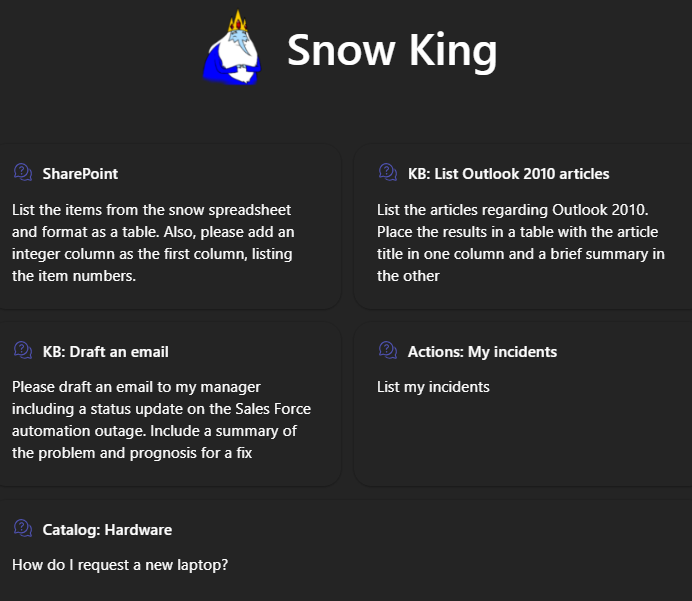

# Snow King - Declarative Agent for M365 Copilot

This project showcases the use of a Declarative Agent for Microsoft 365 Copilot, designed to create personalized experiences through specific instructions, actions, and knowledge. Specializing in ServiceNow, this declarative agent leverages the following capabilities and actions:

* **SharePoint Integration**: Enables users to retrieve information from files, which can be useful for providing context to ServiceNow tickets and for creating new tickets. 

* **Graph Connectors**: Utilizes the Knowledge Base and Services Catalog connectors from ServiceNow to enhance functionality.

* **Plugins**: Incorporates a ServiceNow Scripted REST API that allows users to list their incidents and create new ones.

## Build a basic declarative agent with API plugin

Declarative agents are customized versions of Microsoft 365 Copilot that help you to create personalized experiences by declaring specific instructions, actions, and knowledge. 

With the declarative agent, you can build a custom version of Copilot that can be used for specific scenarios, such as for specialized knowledge, implementing specific processes, or simply to save time by reusing a set of AI prompts. For example, a grocery shopping Copilot declarative agent can be used to create a grocery list based on a meal plan that you send to Copilot.

You can extend declarative agents using plugins to retrieve data and execute tasks on external systems. A declarative agent can utilize multiple plugins at the same time.

## Get started

> **Prerequisites**
>
> To run this app template in your local dev machine, you will need:
>
> - [Node.js](https://nodejs.org/), supported versions: 16, 18
> - A [Microsoft 365 account for development](https://docs.microsoft.com/microsoftteams/platform/toolkit/accounts).
> - [Teams Toolkit Visual Studio Code Extension](https://aka.ms/teams-toolkit) version 5.0.0 and higher or [Teams Toolkit CLI](https://aka.ms/teamsfx-toolkit-cli)
> - [Microsoft 365 Copilot license](https://learn.microsoft.com/microsoft-365-copilot/extensibility/prerequisites#prerequisites)
> - [ServiceNow Developer Instance](https://developer.servicenow.com/dev.do)

1. First, select the Teams Toolkit icon on the left in the VS Code toolbar.
2. In the Account section, sign in with your [Microsoft 365 account](https://docs.microsoft.com/microsoftteams/platform/toolkit/accounts) if you haven't already.
3. Create Teams app by clicking `Provision` in "Lifecycle" section.
4. Select `Preview in Copilot (Edge)` or `Preview in Copilot (Chrome)` from the launch configuration dropdown.
4. Select your declarative agent from the `Copilot` app.
5. Send a prompt.

## What's included in the project

| Folder       | Contents                                     |
| ------------ | -------------------------------------------- |
| `.vscode`    | VSCode files for debugging                   |
| `appPackage` | Templates for the Teams application manifest, the plugin manifest and the API specification |
| `env`        | Environment files                            |

The following files can be customized and demonstrate an example implementation to get you started.

| File                                 | Contents                                                                       |
| ------------------------------------ | ------------------------------------------------------------------------------ |
| `appPackage/declarativeCopilot.json` | Define the behaviour and configurations of the declarative agent.            |
| `appPackage/manifest.json`           | Teams application manifest that defines metadata for your declarative agent. |
| `appPackage/instructions.txt`           | Define how the agent should communicate. An agent might be concise, detailed, interactive, or suggestive. Also include any restrictions that should be applied. |
| `appPackage/ai-plugin.json`           | It contains everything Copilot needs to know about the API that isn’t in the Swagger file. It breaks the API down into “functions” that share a common URL path and result set.  |
| `appPackage/apiSpecificationFile/openapi.json`           | It is the Swagger file for the API.  |

The following are Teams Toolkit specific project files. You can [visit a complete guide on Github](https://github.com/OfficeDev/TeamsFx/wiki/Teams-Toolkit-Visual-Studio-Code-v5-Guide#overview) to understand how Teams Toolkit works.

| File                 | Contents                                                                                                                                  |
| -------------------- | ----------------------------------------------------------------------------------------------------------------------------------------- |
| `teamsapp.yml`       | This is the main Teams Toolkit project file. The project file defines two primary things: Properties and configuration Stage definitions. |

### Addition information and references

- [Declarative agents for Microsoft 365](https://aka.ms/teams-toolkit-declarative-agent)
- [Extend Microsoft 365 Copilot](https://aka.ms/teamsfx-copilot-plugin)
- [Message extensions for Microsoft 365 Copilot](https://learn.microsoft.com/microsoft-365-copilot/extensibility/overview-message-extension-bot)
- [Microsoft Graph Connectors for Microsoft 365 Copilot](https://learn.microsoft.com/microsoft-365-copilot/extensibility/overview-graph-connector)
- [Microsoft 365 Copilot extensibility samples](https://learn.microsoft.com/microsoft-365-copilot/extensibility/samples)

## Build a basic declarative agent with API plugin

