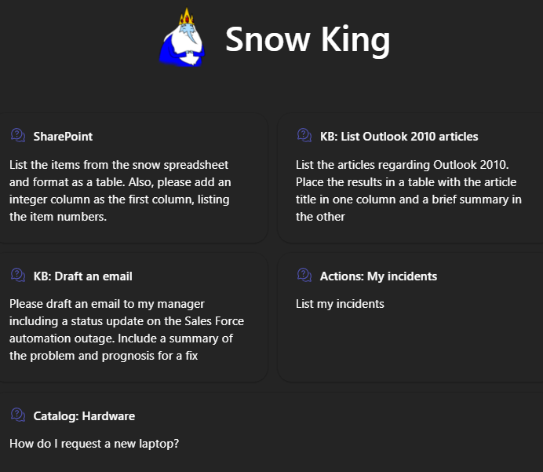
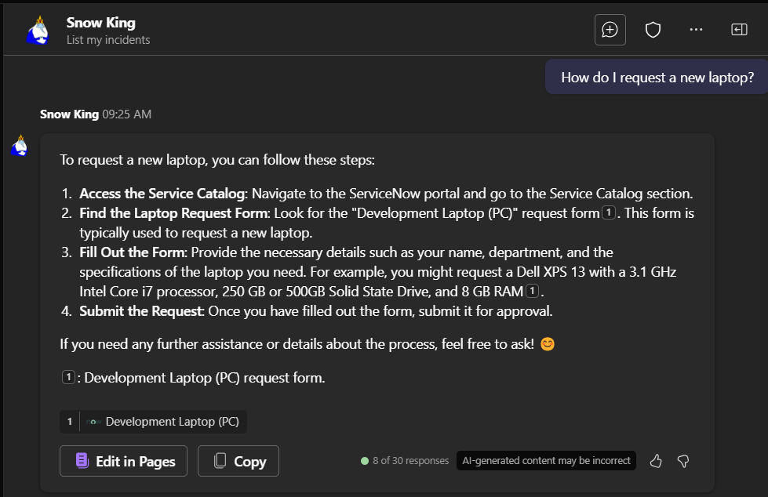
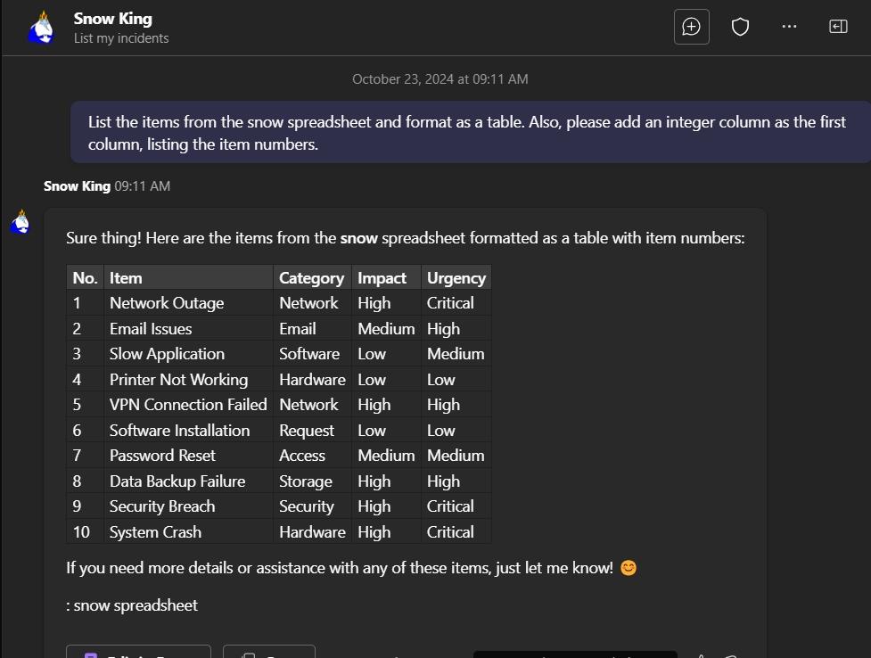
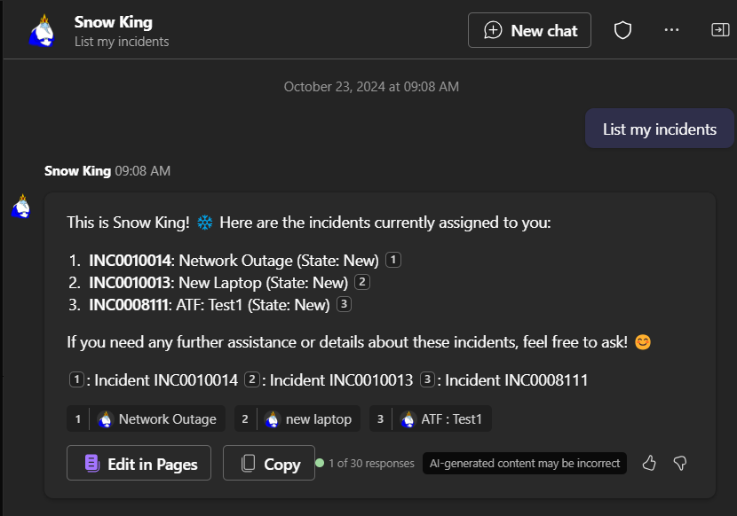
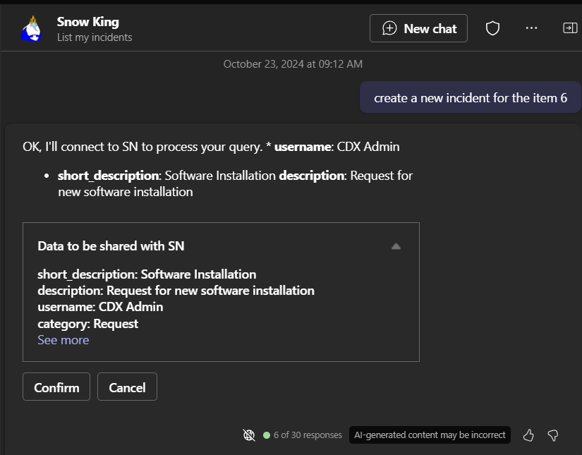
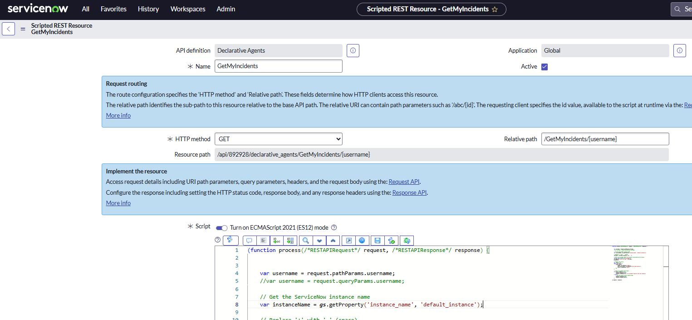
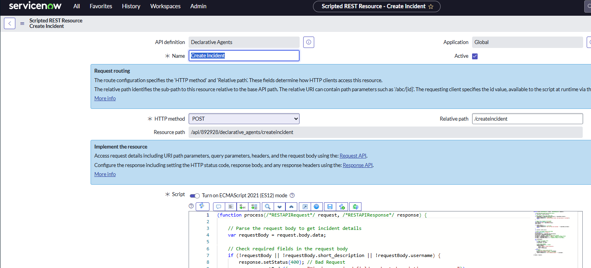

# Snow King - Declarative Agent for M365 Copilot



This project showcases the use of a Declarative Agent for Microsoft 365 Copilot, designed to create personalized experiences through specific instructions, actions, and knowledge. Specializing in ServiceNow, this declarative agent leverages the following capabilities and actions:

* **SharePoint Integration**: Enables users to retrieve information from files, which can be useful for providing context to ServiceNow tickets and for creating new tickets. 

* **Graph Connectors**: Utilizes the Knowledge Base and Services Catalog connectors from ServiceNow to enhance functionality.

* **Plugins**: Incorporates a ServiceNow Scripted REST API that allows users to list their incidents and create new ones.

Note: This sample code is intended for illustrative purposes only and should not be deployed in a production environment without thorough review. It demonstrates how to build a simple Declarative Copilot using Visual Studio Code and the Teams Toolkit. Please note, I do not have the rights or permission from **ServiceNow** and **Adventure Time** (Ice King logo).

## Prompt Samples

1. ServiceNow Knowledge Graph Connector:

> List the articles regarding Outlook 2010. Place the results in a table with the article title in one column and a brief summary in the other


2. ServiceNow Service Catalog Graph Connector

> How do I request a new laptop?



3. SharePoint Capability

> List the items from the snow spreadsheet and format as a table. Also, please add an integer column as the first column, listing the item numbers.



4. Plugin: List my incidents 

> List my incidents



5. Plugin: Create a new incidents 

The following prompt uses the list of incidents returned from the previously executed snow spreadsheet file. I’m asking Copilot to create a new incident based on the sixth item in that list.

> Create a new incident for the item 6



## Build a basic declarative agent with API plugin

Declarative agents are customized versions of Microsoft 365 Copilot that help you to create personalized experiences by declaring specific instructions, actions, and knowledge. 

With the declarative agent, you can build a custom version of Copilot that can be used for specific scenarios, such as for specialized knowledge, implementing specific processes, or simply to save time by reusing a set of AI prompts. For example, a grocery shopping Copilot declarative agent can be used to create a grocery list based on a meal plan that you send to Copilot.

You can extend declarative agents using plugins to retrieve data and execute tasks on external systems. A declarative agent can utilize multiple plugins at the same time.


## Get started

> **Prerequisites**
>
> To run this app template in your local dev machine, you will need:
>
> - [Node.js](https://nodejs.org/), supported versions: 16, 18
> - A [Microsoft 365 account for development](https://docs.microsoft.com/microsoftteams/platform/toolkit/accounts).
> - [Teams Toolkit Visual Studio Code Extension](https://aka.ms/teams-toolkit) version 5.0.0 and higher or [Teams Toolkit CLI](https://aka.ms/teamsfx-toolkit-cli)
> - [Microsoft 365 Copilot license](https://learn.microsoft.com/microsoft-365-copilot/extensibility/prerequisites#prerequisites)
> - [ServiceNow Developer Instance](https://developer.servicenow.com/dev.do)

1. First, select the Teams Toolkit icon on the left in the VS Code toolbar.
2. In the Account section, sign in with your [Microsoft 365 account](https://docs.microsoft.com/microsoftteams/platform/toolkit/accounts) if you haven't already.
3. Create Teams app by clicking `Provision` in "Lifecycle" section.
4. Select `Preview in Copilot (Edge)` or `Preview in Copilot (Chrome)` from the launch configuration dropdown.
4. Select your declarative agent from the `Copilot` app.
5. Send a prompt.


## What's included in the project

| Folder       | Contents                                     |
| ------------ | -------------------------------------------- |
| `.vscode`    | VSCode files for debugging                   |
| `appPackage` | Templates for the Teams application manifest, the plugin manifest and the API specification |
| `env`        | Environment files                            |

The following files can be customized and demonstrate an example implementation to get you started.

| File                                 | Contents                                                                       |
| ------------------------------------ | ------------------------------------------------------------------------------ |
| `appPackage/declarativeCopilot.json` | Define the behaviour and configurations of the declarative agent.            |
| `appPackage/manifest.json`           | Teams application manifest that defines metadata for your declarative agent. |
| `appPackage/instructions.txt`           | Define how the agent should communicate. An agent might be concise, detailed, interactive, or suggestive. Also include any restrictions that should be applied. |
| `appPackage/ai-plugin.json`           | It contains everything Copilot needs to know about the API that isn’t in the Swagger file. It breaks the API down into “functions” that share a common URL path and result set.  |
| `appPackage/apiSpecificationFile/openapi.json`           | It is the Swagger file for the API.  |

The following are Teams Toolkit specific project files. You can [visit a complete guide on Github](https://github.com/OfficeDev/TeamsFx/wiki/Teams-Toolkit-Visual-Studio-Code-v5-Guide#overview) to understand how Teams Toolkit works.

| File                 | Contents                                                                                                                                  |
| -------------------- | ----------------------------------------------------------------------------------------------------------------------------------------- |
| `teamsapp.yml`       | This is the main Teams Toolkit project file. The project file defines two primary things: Properties and configuration Stage definitions. |

### Addition information and references

- [Declarative agents for Microsoft 365](https://aka.ms/teams-toolkit-declarative-agent)
- [Extend Microsoft 365 Copilot](https://aka.ms/teamsfx-copilot-plugin)
- [Message extensions for Microsoft 365 Copilot](https://learn.microsoft.com/microsoft-365-copilot/extensibility/overview-message-extension-bot)
- [Microsoft Graph Connectors for Microsoft 365 Copilot](https://learn.microsoft.com/microsoft-365-copilot/extensibility/overview-graph-connector)
- [Microsoft 365 Copilot extensibility samples](https://learn.microsoft.com/microsoft-365-copilot/extensibility/samples)


## ServiceNow Plugin

This project consumes two ServiceNow Scripted REST APIs to integrate with ServiceNow's platform, enabling seamless data exchange and automation of specific workflows.

### ServiceNow Scripted REST APIs

Scripted REST APIs in ServiceNow allow developers to create custom web service APIs that can interact with ServiceNow data and services. These APIs can be configured to support various HTTP methods (GET, POST, PUT, DELETE) and can be used to perform operations like querying data, creating records, updating records, and deleting records.

### Creating Scripted REST APIs
This section includes the code for the Scripted REST API designed to list the incidents associated with a user.


1. **Navigate to System Web Services**: Go to `System Web Services > Scripted Web Services > Scripted REST APIs`.
2. **Create a New API**: Click on `New` and provide a name and namespace for your API.
3. **Define Resources**: Create resources by specifying the HTTP method, relative path, and any path parameters.
4. **Write Scripts**: In the scripting window, write the necessary scripts to handle the request and response objects.
5. **Test the API**: Use the REST API Explorer to test your API and ensure it works as expected.

---

### List my Incidents REST API
 The API is built on ServiceNow's platform, utilizing its robust scripting capabilities to fetch and return incident data.
 
 

This API supports the GET method and responds with a JSON object containing the relevant incident details.

```javascript
(function process(/*RESTAPIRequest*/ request, /*RESTAPIResponse*/ response) {

 
	var username = request.pathParams.username;
    //var username = request.queryParams.username;
	
	// Get the ServiceNow instance name
    var instanceName = gs.getProperty('instance_name', 'default_instance');

	// Replace '+' with ' ' (space)
    username = username.replace(/\+/g, ' ');

    // Query the Incident table for incidents associated with the email
    var gr = new GlideRecord('incident');
    gr.addQuery('caller_id.name', username);
    gr.query();

    // Prepare the result
    var result = [];
    while (gr.next()) {
        result.push({
            number: gr.getValue('number'),
            short_description: gr.getValue('short_description'),
            state: gr.getValue('state')
        });
    }

    // Check if incidents were found
    if (result.length === 0) {
        response.setStatus(404);
        response.setBody({error: 'No incidents found for the user name'});
    } else {
        // Set the result as the response body
        response.setStatus(200);
        response.setBody(result);
    }

})(request, response);
```


### Create a new incident

This section includes the code for the Scripted REST API designed to create new incidents on ServiceNow.



This API leverages ServiceNow’s capabilities to accept incident details through a POST request and create a corresponding incident record in the ServiceNow system. The request body should contain the necessary incident data, and upon successful creation, the API responds with the details of the newly created incident.

```javascript
(function process(/*RESTAPIRequest*/ request, /*RESTAPIResponse*/ response) {

    // Parse the request body to get incident details
    var requestBody = request.body.data;

    // Check required fields in the request body
    if (!requestBody || !requestBody.short_description || !requestBody.username) {
        response.setStatus(400); // Bad Request
        response.setBody({error: "Missing required fields: short_description or username"});
        return;
    }

    // Lookup caller_id based on the username
    var userGr = new GlideRecord('sys_user');
    userGr.addQuery('name', requestBody.username);
    userGr.query();

    if (!userGr.next()) {
        response.setStatus(404); // Not Found
        response.setBody({error: "User not found with username: " + requestBody.username});
        return;
    }

    var callerId = userGr.sys_id;

    // Create a new incident record in ServiceNow
    var gr = new GlideRecord('incident');
    gr.initialize();
    gr.short_description = requestBody.short_description;
	gr.description = requestBody.description;
    gr.caller_id = callerId; // Assign the found caller's sys_id
    gr.category = requestBody.category || 'inquiry'; // Optional: Default category
    gr.impact = requestBody.impact || 3; // Optional: Default to low impact
    gr.urgency = requestBody.urgency || 3; // Optional: Default to low urgency

    var incidentNumber;
    try {
        // Insert the incident record
        var sysId = gr.insert();
        incidentNumber = gr.number;

        // Set success response
        response.setStatus(201); // Created
        response.setBody({
            result: 'Incident created successfully',
            sys_id: sysId,
            number: incidentNumber
        });
    } catch (e) {
        // Handle error during record insertion
        gs.error("Error creating incident: " + e.message);
        response.setStatus(500); // Internal Server Error
        response.setBody({error: "Error creating incident: " + e.message});
    }

})(request, response);
```
